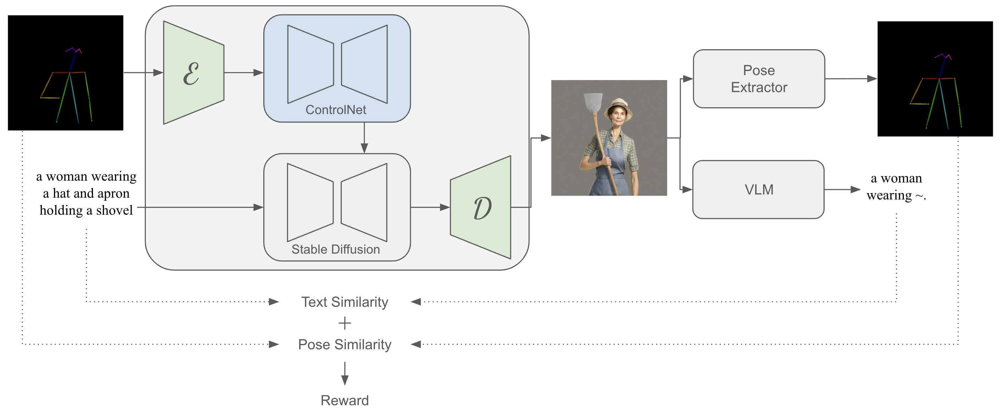
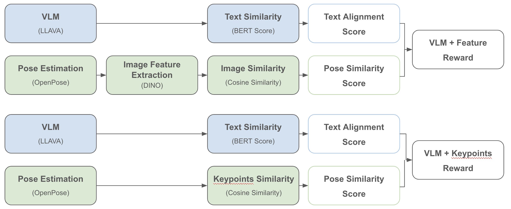
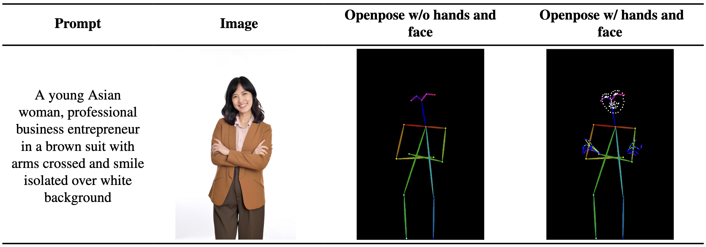
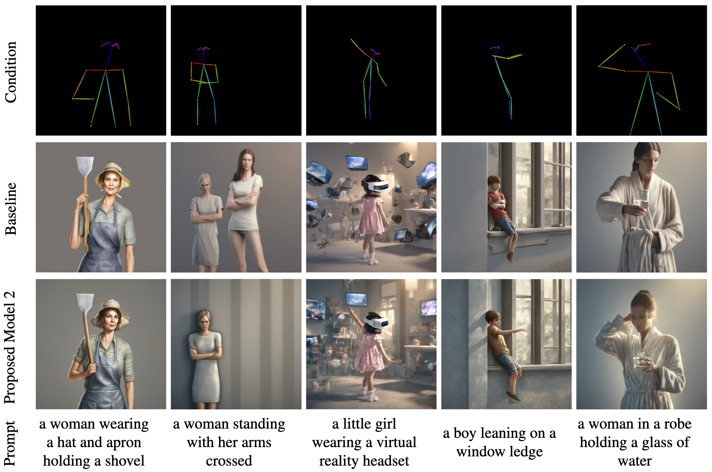
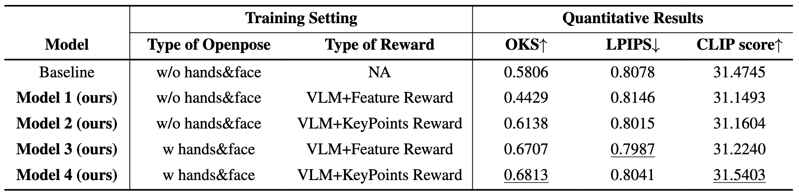

# **Improving Human Pose-Conditioned Generation: <br/> Fine-tuning ControlNet Models with Reinforcement Learning**
<p align="center">
  
</p>

**Improving Human Pose-Conditioned Generation: Fine-tuning ControlNet Models with Reinforcement Learning** is a novel fine-tuning framework that enhances the reflection of conditioning images by integrating reinforcement learning into ControlNet models.

## Methodology
Our proposed framework fine-tunes ControlNet with the DDPO strategy. Unlike the original DDPO applying reinforcement learning to the Stable Diffusion model, we applies RL to the ControlNet model to enable learning new conditioning images. Instead of using the latent spae loss for training like ControlNet, we modified this to a reward system and applied DDPO's multi-step MDP. Additionally, unlike DDPO, we focus on pose-based human image generation. For this, we use a pose accuracy reward in addition to DDPO's text alignment reward. 

### Reward
<p align="center">
  
</p>

We propose two kinds of reward functions that allow improving image-human pose alignment while maintaining image-text alignment.

## Installation

## Training
Our training code is based on DDPO and ControlNet.
- DDPO: https://github.com/huggingface/trl/blob/main/examples/scripts/ddpo.py
- ControlNet: https://github.com/huggingface/diffusers/blob/main/examples/controlnet/train_controlnet_sdxl.py


### 1. Training Dataset
<p align="center">
  
</p>
<p>
You need at least 10K 1024*1024 source images and corresponding pose conditioning images and prompts for training. Pose conditioning images can be obtained by extracting poses from source images using the OpenPose model. For pose conditioning images, you can choose between OpenPose without hands and face & OpenPose with hands and face.

We collected 31K images and alternative text pairs from several license-free image sites, such as freepik and  adobestock. We ensured that the images contained humans throughout the collection process. The resolution of collected images is 1024x1024. Both types of OpenPose images, with or without facial landmarks and hands keypoints, are extracted from each image. Each dataset sample consists of three images and a text component: the collected image, OpenPose image, OpenPose with hands and face keypoints, and image caption. The dataset is split into train and test at a ratio of 30 to 1. The test dataset consists of 1000 real images of a single person.

If the training dataset is ready, a jsonl file that contains all dataset information is required. Keys for the jsonl file have to be  "image", "condition_image" and "text". The example of the jsonl file is as follows:
</p>

```json
{"image": "source/image/path1", "condition_image": "conditioning/image/path1", "text": "prompt1"}
{"image": "source/image/path2", "condition_image": "conditioning/image/path2", "text": "prompt2"}
{"image": "source/image/path3", "condition_image": "conditioning/image/path3", "text": "prompt3"}
...

```

### 2. Models
#### Models used for training
- Stable Diffusion XL -> stabilityai/stable-diffusion-xl-base-1.0
- ControlNet Openose SDXL -> thibaud/controlnet-openpose-sdxl-1.0
- VAE SDXL -> madebyollin/sdxl-vae-fp16-fix

#### Models used for reward computation
- LLAVAl -> lava-hf/llava-v1.6-mistral-7b-hf
- OpenPose Detector -> lllyasviel/ControlNet
- DINO -> facebook/dinov2-base

### 3. Codes to be replaced
써야함 </br>
써야함 </br>
써야함 </br>
써야함 </br>
써야함 </br>

### 4. Strat Training
You can simply train the model with **VLM + Keypoints Reward fuction** by executing the shell file shown below.

```bash
export MODEL_DIR="stabilityai/stable-diffusion-xl-base-1.0"
export OUTPUT_DIR="output/path"

accelerate launch --config_file "config.yaml" train_controlnet_sdxl.py \
 --pretrained_model_name_or_path=$MODEL_DIR \
 --pretrained_vae_model_name_or_path madebyollin/sdxl-vae-fp16-fix \
 --controlnet_model_name_or_path thibaud/controlnet-openpose-sdxl-1.0 \
 --output_dir=$OUTPUT_DIR \
 --resolution=1024 \
 --train_data_dir='train_jsonl_file/path' \
 --checkpointing_steps 50 \
 --train_batch_size=2 \
 --gradient_accumulation_steps=4 \
 --learning_rate 1e-6 \
 --num_train_inference_steps 50 \
 --image_log_dir "image_log/path" \ #to save sample images
 --enable_xformers_memory_efficient_attention \
 --set_grads_to_none \
 --mixed_precision="fp16" \
 --caption_column="text" \
 --conditioning_image_column="condition_image" \
 --use_8bit_adam \
 --num_train_epochs=3
```

### 5. Training Details
 Our models are trained with four NVIDIA RTX A6000 using the same conditions: learning rate = $2 \times 10^{-6}$, batch size per GPU  is two images, and sampling steps of $50$. Training steps for models vary, as $10025$, $18775$, $22525$, and $22525$, because we use the model, which is saved when the reward is maximized.

A higer learning rate, $1 \times 10^{-5}$, resulted in overfitting and a lower learning rate, $1 \times 10^{-6}$, resulted in much longer training time.


## Evaluation

### 1. Models Used for Evaluation
- **Baseline Model**: ControlNet Openose SDXL (thibaud/controlnet-openpose-sdxl-1.0)
- **Trained Model by Proposed Architecture**: A model which achieved the highest reward during training before overfitting.

### 2. Eval Dataset
Source images and its corresponding keypoints and prompts have to be prepared separately. Results from the trained model by our mehtod and the baseline model can be generated by executing the code below. A csv file consists of names of conditioning images and prompts from source images.

```bash
python "data_generation_trained_model.py" \
--csv "/csv/path" \
--condition_image_path "/pose_conditioning_image/path" \
--save_dir "/save/path" \
--resolution 1024 \
--controlnet_model "/trained_model_or_baseline_model/path"
```

### 3. Start Evaluation
Evaluation codes are under ./eval.

#### - Pose Accuracy(OKS)
Object Keypoint Similarity (OKS) is assessing pose accuracy, measuring the distance between similarity in original and generated images on a scale from 0 to 1. A higher OKS score indicates better pose accuracy. 

0. no installation required
1. calculate OKS
```
python ./oks/oks_score.py --original original/keypoints/path --target target/keypoints/path
```


#### - Text Alignment(CLIP)
The CLIP is used for text alignment, which evaluates the similarity between generated images and their corresponding text representations, ranging from 1 to 100. Higher CLIP scores signify greater alignment between the text and the image. Like the LPIPS score, the CLIP score correlates highly with human judgment. 

0. install clip from github
```
pip install git+https://github.com/openai/CLIP.git
```
1. prepare for the text prompt, if needed
```
python ./clip/csv_to_file.py
```
2. calculate clip score : text/path would be ./multiple_text or ./single_text
```
python ./clip/clip_score.py image/path text/path
```

#### - Image Quality(LPIPS)
LPIPS (Learned Perceptual Image Patch Similarity) is used for image quality evaluation, which measures perceptual similarity between the original and generated images, with scores ranging from 0 to 1. Lower LPIPS scores indicate better image quality and higher similarity to the original images. This measure has been demonstrated to closely match human perception.

0. install lpips
```
pip install lpips
```
1. calculate lpips score
```
python ./lpips/lpips_score.py -d0 original/image/path_0 -d1 generated/image/path_1
```

## Results
### 1. Qualitative Results
<p align="center">
  
</p>
(first row) Skeleton image conditions, (second row) the generated images by the ControlNet as a baseline model, (third row) the generated images by our model, (last row) the input prompts.

### 2. Quantitative Results
<p align="center">
  
</p>

Quantitative Evaluation Results of the proposed and baseline models. The best values in each category are underlined.